# 🛡️ Home Network Security Lab

Mini lab de sécurité réseau simulant une infrastructure d'entreprise
segmentée, protégée par un pare-feu pfSense et surveillée par un IDS Suricata.

## 🎯 Objectif

Concevoir et documenter une architecture réseau sécurisée avec
segmentation (LAN / DMZ), filtrage du trafic, NAT et détection d'intrusion,
puis valider le tout par des tests offensifs et défensifs.

## 🧰 Technologies

| Outil | Rôle |
|-------|------|
| pfSense 2.9.0 | Pare-feu / routeur / NAT |
| Suricata (ET Open) | IDS (détection d'intrusion) |
| Wireshark | Capture et analyse du trafic |
| Debian 13 | Serveur en DMZ (Apache, SSH) |
| Kali Linux | Machine d'attaque / de test (LAN) |
| VMware Workstation | Virtualisation |

## 🗺️ Architecture

```
            Internet
                |
          NAT VMware (VMnet8)
                |
             pfSense
                |
        -----------------
        |               |
       LAN             DMZ
        |               |
      Kali         Debian Server
```

| Zone | Réseau | Machine | Rôle |
|------|--------|---------|------|
| WAN | DHCP (NAT VMware, VMnet8) | pfSense (em0) | Accès Internet |
| LAN | 192.168.1.0/24 (segment `lan`) | Kali Linux | Poste client / attaquant |
| DMZ | 192.168.2.0/24 (segment `dmz`) | Debian Server (192.168.2.10) | Serveur exposé |

La segmentation repose sur des **LAN Segments VMware** isolés (`lan` et `dmz`) :
chaque zone est sur un réseau virtuel distinct, et tout le trafic entre elles
passe obligatoirement par pfSense.


## ⚙️ Configuration

### 1. Installation de pfSense
VM pfSense à 3 cartes réseau (WAN en NAT, LAN et DMZ en LAN Segments),
interfaces assignées depuis la console, puis Setup Wizard via l'interface web.
L'option « Block RFC1918 » a été désactivée sur le WAN, car celui-ci se trouve
lui-même sur un réseau privé (NAT VMware).

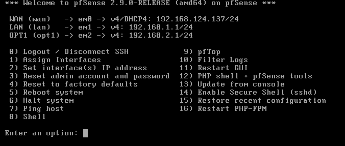
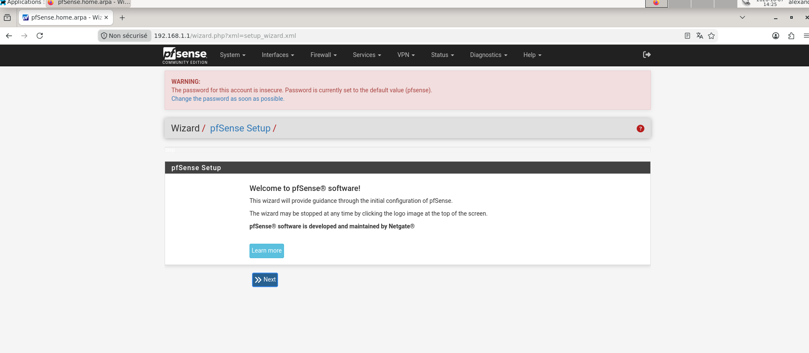

### 2. Interfaces et segmentation
Interfaces WAN, LAN et DMZ (renommée depuis OPT1), serveur DHCP sur le LAN
(plage `192.168.1.100` – `192.168.1.200`). Pas de DHCP sur la DMZ : le serveur
utilise une IP fixe.

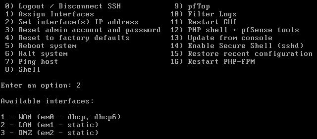
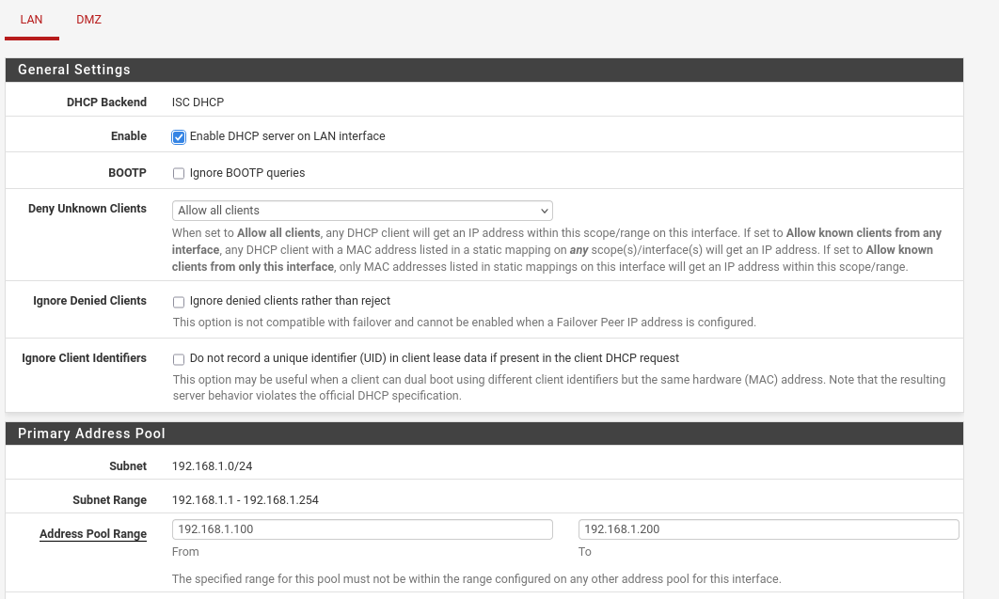

### 3. Installation des VM
- **Kali Linux** (LAN) : IP obtenue en DHCP (`192.168.1.101`).
- **Debian Server** (DMZ) : IP fixe `192.168.2.10/24`, passerelle `192.168.2.1`,
  Apache et OpenSSH installés.

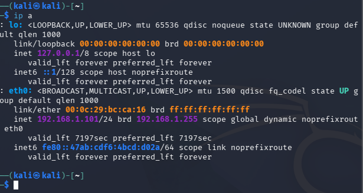
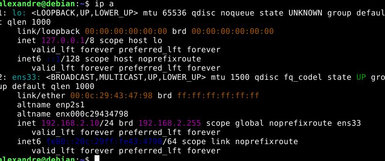

### 4. Règles de pare-feu

**Test avant règles** : depuis Kali, le ping, le HTTP et le SSH vers le serveur
DMZ passent (le LAN dispose d'une règle « allow all » par défaut).

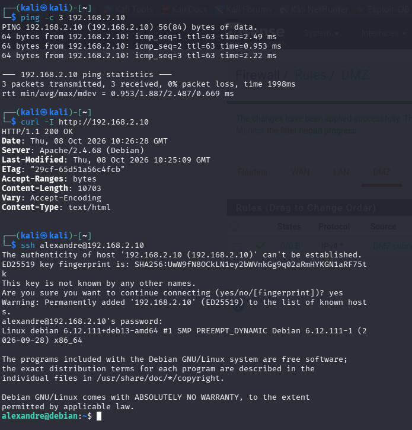

**Règles appliquées** (journalisées pour les blocages) :

| Interface | Ordre | Action | Protocole | Source | Destination |
|-----------|-------|--------|-----------|--------|-------------|
| LAN | 1 | Block | TCP/22 (SSH) | LAN subnets | DMZ subnets |
| LAN | 2 | Pass | ICMP | LAN subnets | DMZ subnets |
| LAN | 3 | Pass | Any | LAN subnets | Any (règle par défaut) |
| DMZ | 1 | Block | Any | DMZ subnets | LAN subnets |
| DMZ | 2 | Pass | Any | DMZ subnets | Any (accès Internet) |

L'ordre des règles est déterminant : pfSense applique la première règle qui
correspond, de haut en bas.


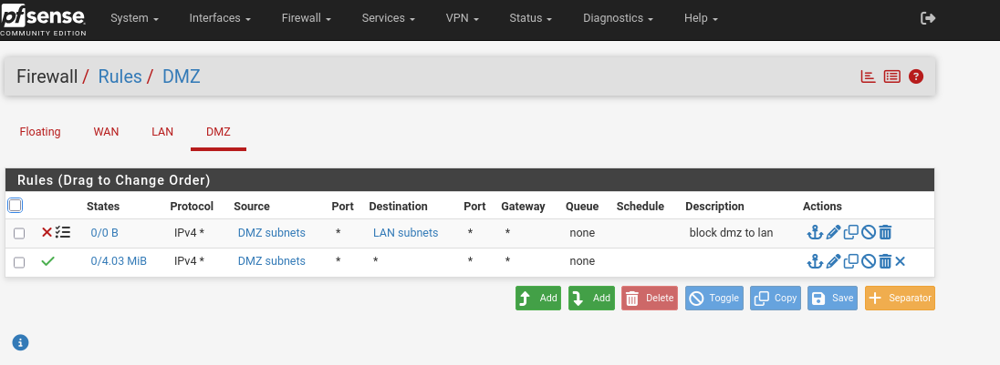

### 5. NAT
NAT sortant en mode automatique : le LAN et la DMZ sortent sur Internet via
l'IP du WAN. Un port forward publie le serveur web de la DMZ (WAN:80 →
`192.168.2.10:80`).

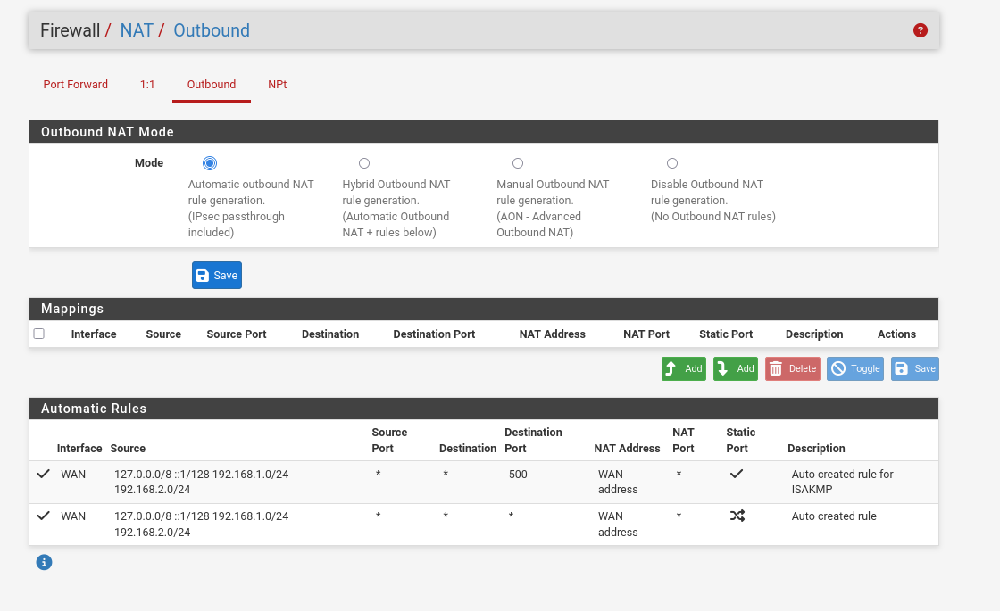
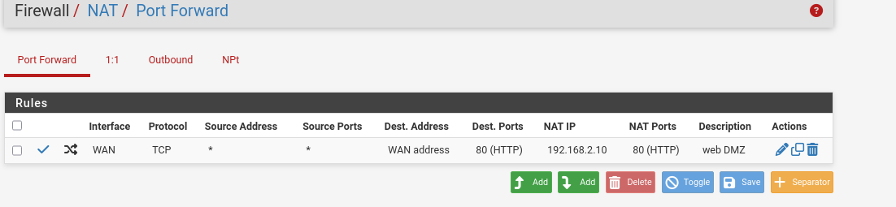

### 6. Tests de connectivité
Après application des règles, depuis Kali : le ping et le HTTP passent, le SSH
expire (timeout). Le blocage est donc ciblé et non une panne réseau. Les logs
pfSense montrent les paquets SYN bloqués (`192.168.1.101` → `192.168.2.10:22`).
Côté DMZ, les pings vers le LAN sont bloqués par la règle `block dmz to lan`.

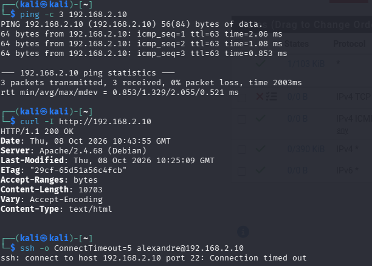
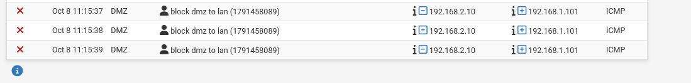


### 7. IDS Suricata
Installation du package, jeu de règles **ET Open**, catégorie
`emerging-scan` activée. Suricata fonctionne en mode alerte uniquement
(pas de blocage), sur l'interface **LAN**, par laquelle entre le trafic de Kali.
L'offloading matériel (checksum, TSO, LRO) a été désactivé, comme l'exige Suricata.

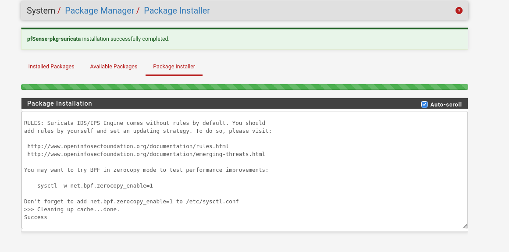
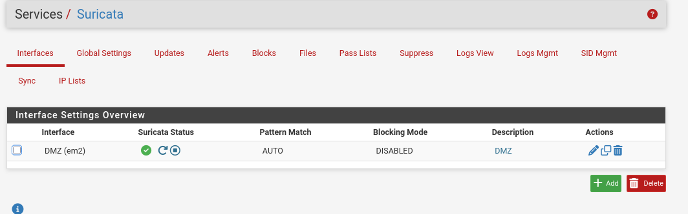
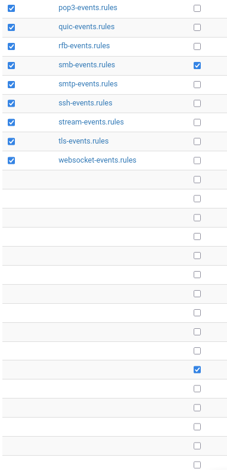

### 8. Test de détection
Scan Nmap depuis Kali vers le serveur DMZ (`nmap -sS -p 1-1000 192.168.2.10`),
alertes générées dans Suricata.

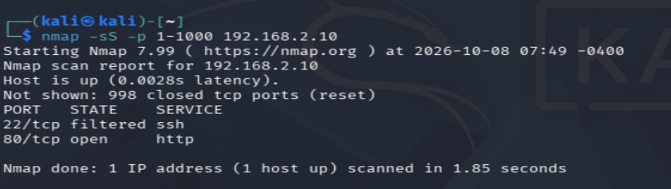
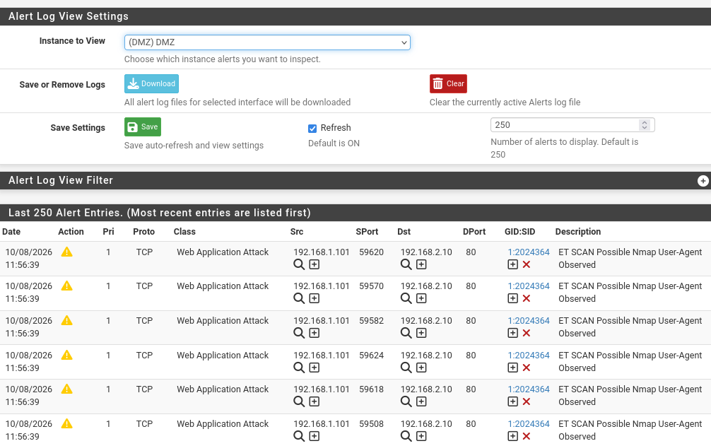

### 9. Capture Wireshark
Capture du scan Nmap sur Kali : rafale de paquets SYN vers des ports différents.
Filtre utilisé : `tcp.flags.syn==1 && tcp.flags.ack==0`.

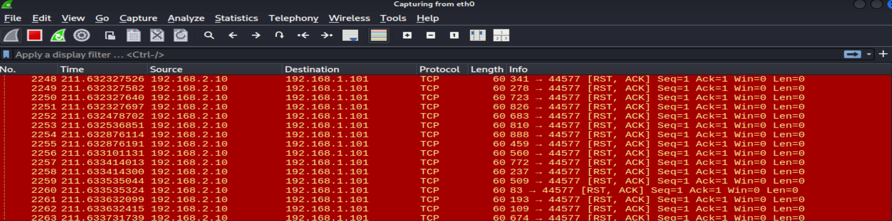
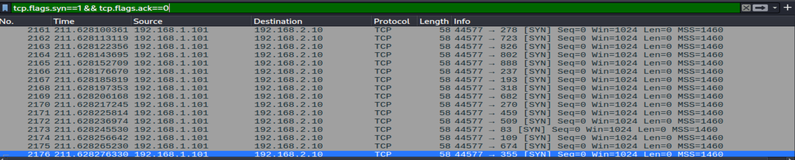

## ✅ Tests et résultats

| Test | Attendu | Résultat |
|------|---------|----------|
| Ping LAN → DMZ | Autorisé | ✅ |
| HTTP LAN → DMZ | Autorisé | ✅ |
| SSH LAN → DMZ | Bloqué | ✅ |
| DMZ → LAN (toute connexion) | Bloqué | ✅ |
| Scan Nmap depuis Kali | Détecté par Suricata | ✅ |

## 🧩 Difficultés rencontrées

- **Pas de ping vers 8.8.8.8** : le Wi-Fi de l'hôte filtrait l'ICMP. L'accès
  Internet a été validé avec `curl` (réponse HTTP 200), pas avec le ping.
- **Sous-réseau VMnet8 modifié** : l'IP du WAN est passée de `192.168.124.x` à
  `192.168.28.x`, ce qui a rendu les premiers tests de passerelle invalides.
- **DMZ → LAN encore autorisé** : la règle de blocage avait été créée sur le
  mauvais onglet. Chaque interface a sa propre liste de règles.
- **Suricata sans alerte sur la DMZ** : le trafic de Kali est inspecté à son
  entrée dans pfSense. L'instance a donc été placée sur le LAN.
- **Avertissement d'offloading** : désactivation du checksum, du TSO et du LRO
  dans *System → Advanced → Networking*.

## 📚 Ce que j'ai appris

- Principes de segmentation réseau et de défense en profondeur
- L'ordre des règles pfSense compte : la première qui correspond s'applique
- Chaque interface pfSense a sa propre politique de filtrage
- Un blocage ciblé se prouve en montrant que les autres flux passent toujours
- Suricata voit le trafic sur l'interface où il entre : le choix de
  l'interface surveillée change ce qui est détecté
- Lecture de paquets avec Wireshark (SYN en rafale, réponses RST/SYN-ACK)

## 🚀 Pistes d'amélioration

- Segmentation par VLAN (802.1Q) au lieu de réseaux séparés
- Passage de la politique LAN en « deny by default »
- Ajout d'un SIEM (Wazuh / ELK) pour centraliser les logs
- Mise en place d'un VPN (OpenVPN / WireGuard)
- Écriture de règles Suricata personnalisées
- Suricata en mode IPS (blocage) plutôt qu'alerte seule
- Ajout d'un serveur web vulnérable en DMZ (DVWA)

## 📁 Structure du dépôt

```
.
├── README.md
├── screenshots/
├── configs/        # exports de config (sans données sensibles)
└── docs/           # notes détaillées
```

## ⚠️ Avertissement

Ce lab est réalisé à des fins pédagogiques, dans un environnement isolé.
